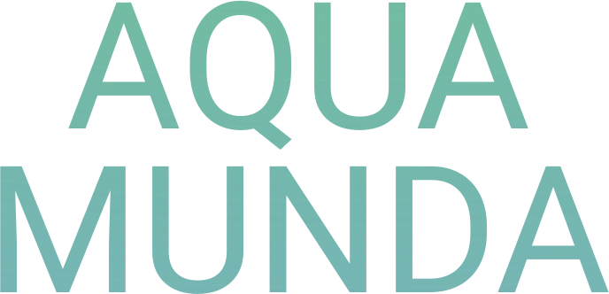
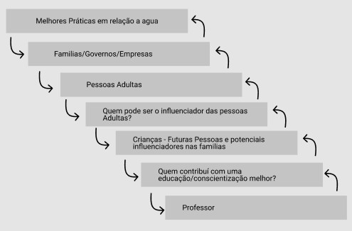

 

    
  <h1 align="center">AQUA MUNDA</h1>
  

    Transformando (e garantindo) o mundo através da educação
  

## About The Project

Projeto desenvolvido durante o evento Call for Code - Hackaton. :computer:

Problema: <code>Água potável e saneamento</code>

Here's why:
* Focar nos professores, pode ser uma excelente forma de promover microrevoluções no centro das famílias - crianças e adolescentes.

### Built With
* [Next.js](https://nextjs.org/)
* [Chakra-ui](https://chakra-ui.com/)
